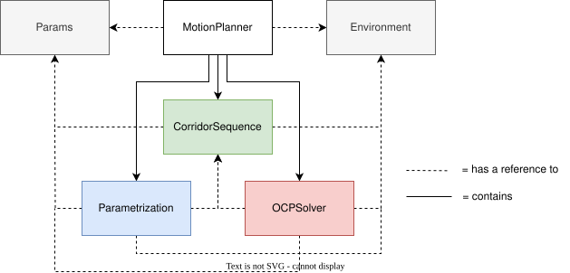
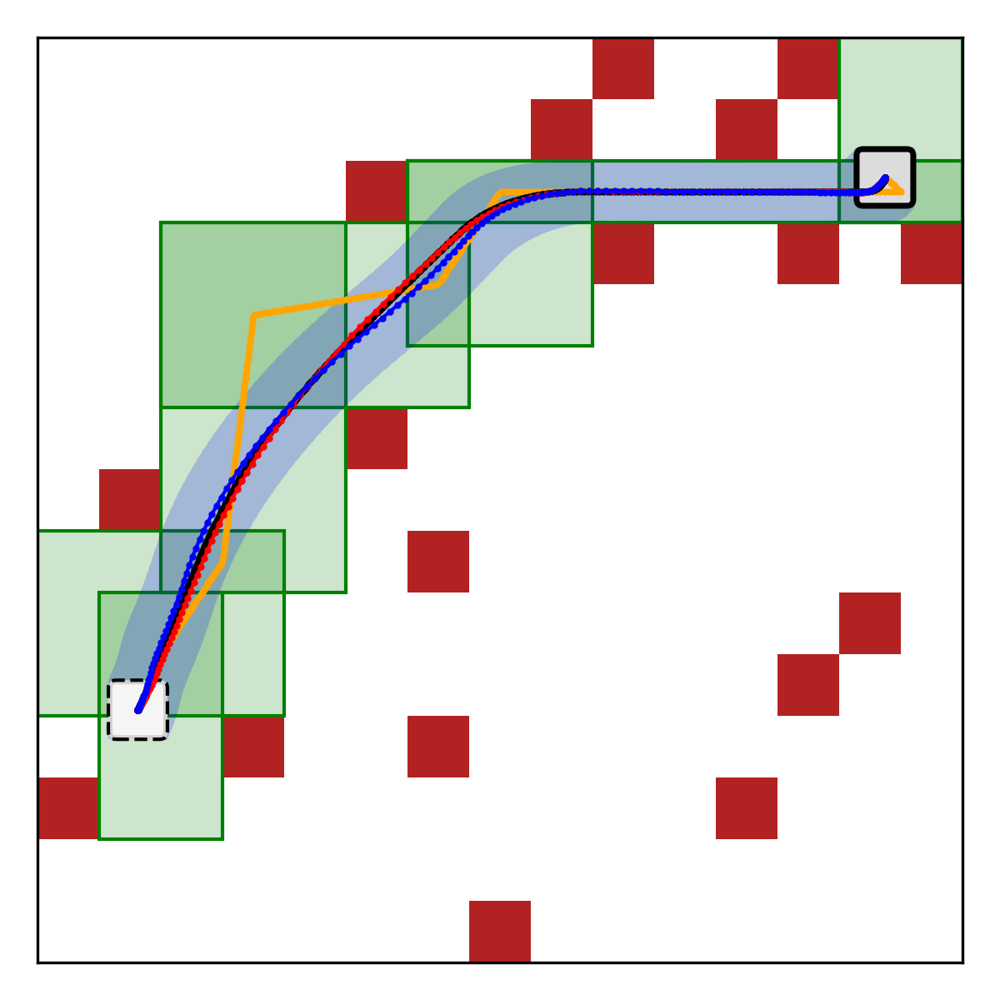
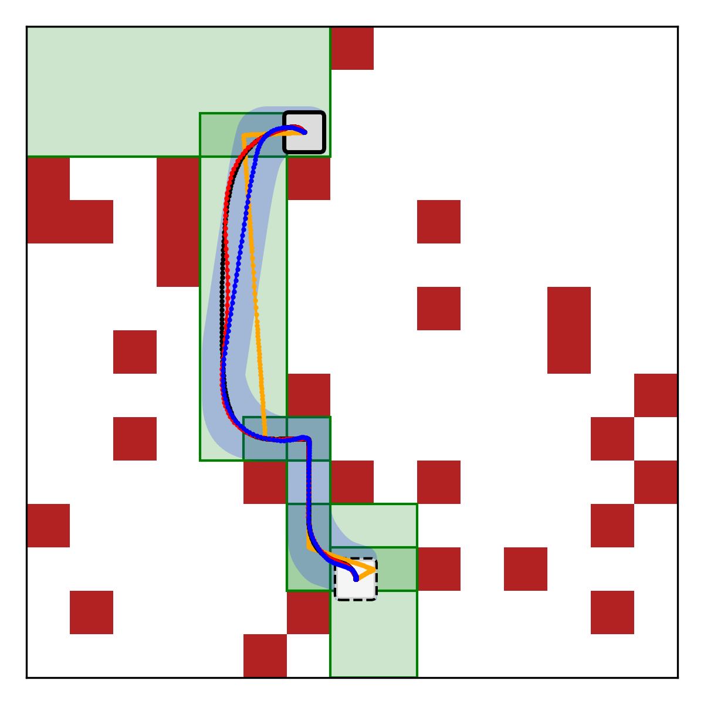
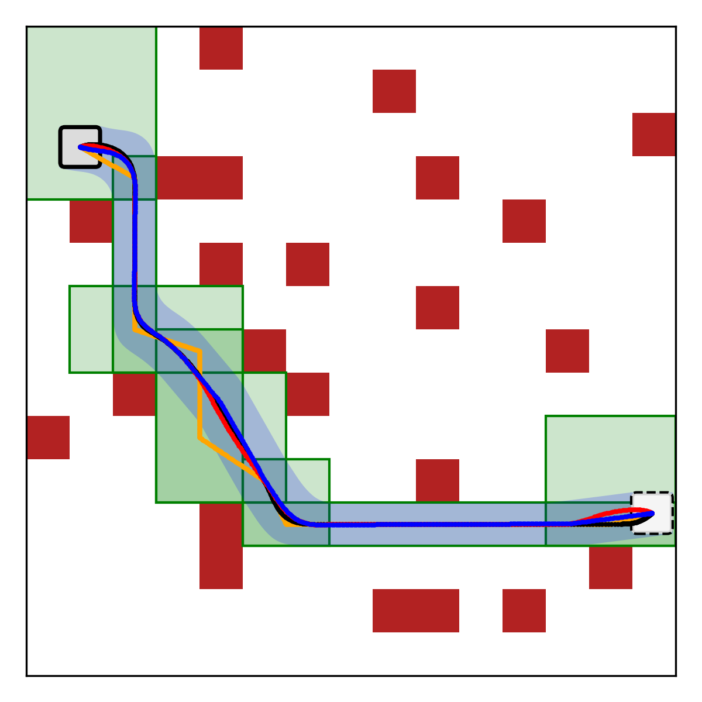
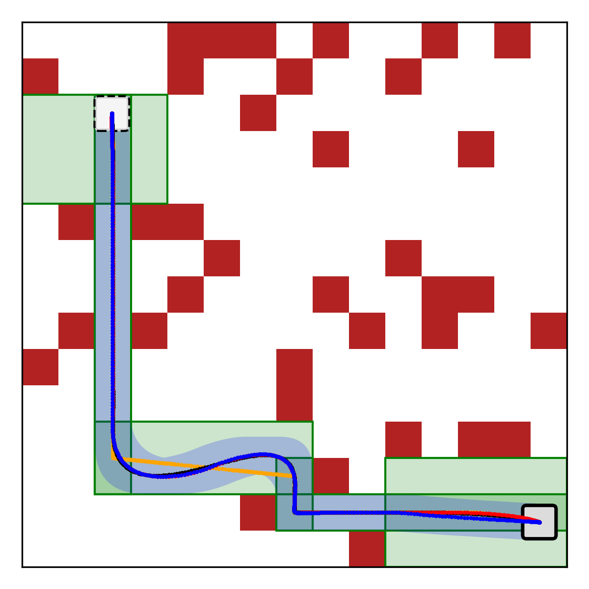
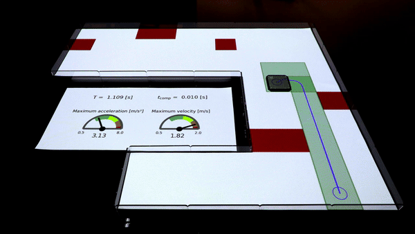

# Fast Time-Optimal Motion Planner for Holonomic Vehicles

This repository contains code to compute time-optimal trajectories for holonomic vehicles with low computation time.
The user defines a set of parameters describing the vehicle and an environment to plan in.

## Overview of the approach
The motion planner constructs a corridor sequence simplifying the environment representation and will plan a dynamically feasible trajectory through these corridors. This can be done either using an OCP-solver or using the parametric motion primitives. Based on heuristics and the corridor layout, these motion primitives represent the solution up to some degrees of freedom. These are fixed by solving an optimization problem.

    

## Validation of the approach
This approach has been validated in simulation and on real hardware.

  
   
  
  

<!-- 

 -->

## Online replanning in dynamic environments
By simulating moving obstacles, a simple event-based replanning scheme can be implemented. When the current corridors are found not to be obstacle-free, the motion planner is triggered to replan.
